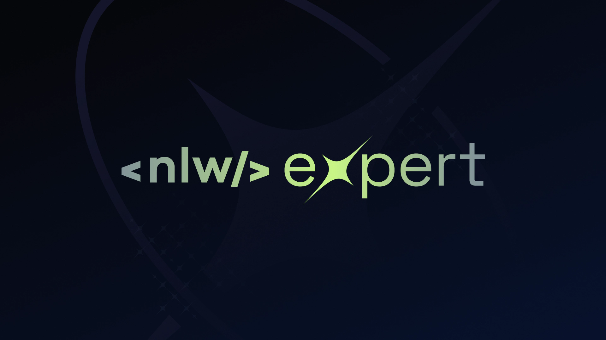

# Notes

[](https://nlw-expert-pearl.vercel.app/)
[Notes - Website](https://nlw-expert-pearl.vercel.app/)

## Description

This project is a front-end application developed in ReactJS, focusing on the implementation of core concepts such as
Properties, States, and Components. It utilizes TypeScript for typing, Vite for tooling, TailwindCSS for a responsive
interface, and incorporates Web APIs like Web Storage and Web Speech.

The primary feature of the application is a note-taking functionality, allowing users to add notes through voice or text
input.

## Technologies Used

- React
- TypeScript
- Vite
- TailwindCSS
- Web Storage API
- Web Speech API

## Getting Started

To run this project locally, follow the steps below:

1. Make sure you have Node.js and npm installed on your machine.
2. Clone this repository.
3. Navigate to the project directory.
4. Install the dependencies by running the following command:```` npm install ````

5. Start the development server with the following command:  ```` npm dev ````

6. This will launch the project in your browser at [http://localhost:4000](http://localhost:4000).

## Build

1. To build the project for production, use the following command: ``` npm build ```

2. This will generate an optimized and minified version of your project in the `dist` directory.
