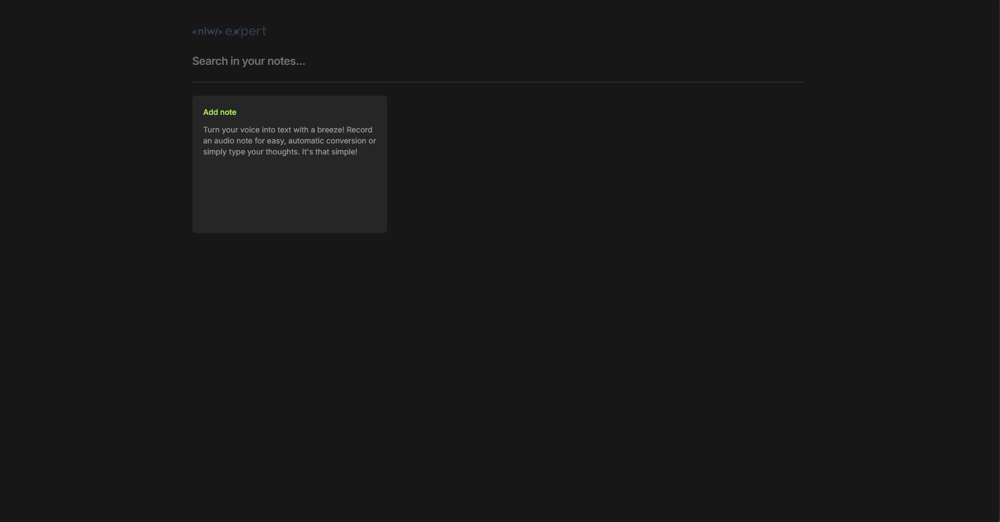

# **SmartNotes**

[](https://nlw-expert-pearl.vercel.app/)

---

## **Description**

**SmartNotes** is a front-end application developed with **ReactJS**, designed to simplify note-taking using both text
and voice input. This application blends modern technologies to deliver an intuitive, responsive, and highly practical
user interface.

### **Key Features**:

- Add or edit notes using **voice** or **keyboard** input.
- Responsive interface built with **TailwindCSS**.
- Data persistence enabled via **Web Storage APIs**.
- Support for **SpeechRecognitionAPI**, enabling voice-to-text note-taking functionality.

**SmartNotes** demonstrates fundamental React concepts, such as **properties**, **state**, and **components**. It
follows best practices by employing **TypeScript**, ensuring robust, type-safe, and maintainable code.

---

## **Technologies Used**

This project was developed using the following tools and technologies:

- **React** — JavaScript library for building user interfaces.
- **TypeScript** — Statically-typed superset of JavaScript for better code quality and safety.
- **Vite** — Fast and efficient development environment.
- **TailwindCSS** — Utility-first CSS framework for rapid and responsive styling.
- **Radix UI** — Accessible and customisable UI components.
- **SpeechRecognitionAPI** — Voice recognition API for voice input functionality.
- **Sonner** — Notification system for user feedback.
- **Web Storage API** — Browser-based storage for local data persistence.

---

## **How to Run the Project Locally**

Follow the steps below to set up and run the project on your local machine:

1. Ensure that you have **Node.js** and **npm** installed.
2. Clone the repository by running the following command in your terminal:

```shell script
  git clone https://github.com/patriciasegantine/smart-notes.git
```

3. Navigate to the project directory:

```shell script
  cd smart-notes
```

4. Install the required dependencies:

```shell script
  npm install
```

5. Start the development server:

```shell script
  npm run dev
```

6. The project will be available in your browser at:  
   [http://localhost:4000](http://localhost:4000).

---

## **How to Build for Production**

To create an optimised production build, execute the following command:

1. Run:

```shell script
  npm run build
```

2. The optimised production build will be located in the **`dist`** directory, ready for deployment to any static
   hosting service.

---

## **Application Preview**

You can see a live preview of the application by clicking the link below:

🔗 [**View Live Application**](https://smartnotesps.vercel.app/)

---

## **Contributing**

Contributions are welcome! Feel free to submit pull requests or open issues if you encounter any problems or have
suggestions for improvement. 😊

How to contribute:

1. Fork the repository.
2. Create a branch for your feature or fix:

```shell script
  git checkout -b my-feature
```

3. Make your changes and commit them.
4. Push the changes to your fork:

```shell script
  git push origin my-feature
```

5. Open a **pull request** describing your changes.

---

## **Licence**

This project is licensed under the **MIT Licence**.


***

Created with ❤️ by Patricia Segantine
